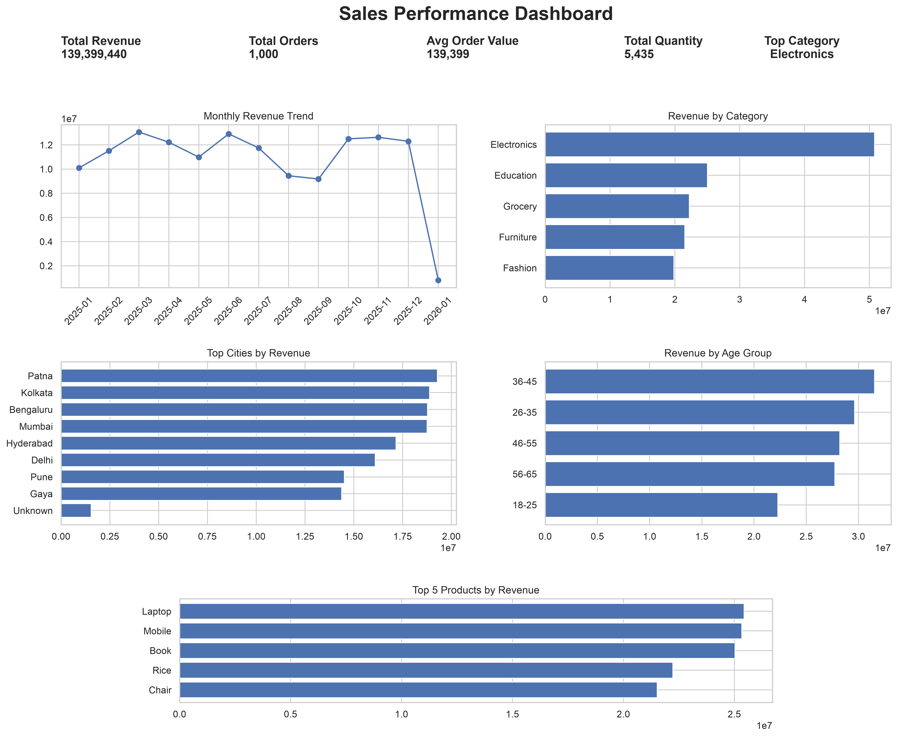

# ApexPlanet Data Analytics Internship

## Task 1: Data Immersion & Wrangling

### Objective

The objective of this task was to understand, assess, clean, transform, and validate the provided sales dataset to create an analysis-ready dataset.

## Dataset

The original dataset contains 1,000 sales transaction records across 12 variables covering:

- Orders
- Customers
- Customer demographics
- Locations
- Products
- Categories
- Quantities
- Prices
- Sales amounts

## Data Quality Issues Identified

- 20 missing values in `Age`
- 13 missing values in `City`
- Eight incorrectly assigned `Order_ID` values
- `Order_Date` stored as string data
- High-value statistical outliers in `Total_Sales`

No exact duplicate records, invalid numerical values, or sales calculation errors were identified.

## Data Cleaning Performed

- Corrected invalid order identifiers
- Converted order dates to datetime
- Imputed missing ages using median age
- Replaced missing cities with `Unknown`
- Standardized text fields
- Validated transaction calculations
- Retained legitimate high-value sales observations

## Feature Engineering

The following analytical variables were created:

- `Order_Year`
- `Order_Month`
- `Order_Month_Name`
- `Age_Group`

## Final Dataset

The cleaned dataset contains:

- 1,000 transaction records
- No missing values
- No duplicate Order IDs
- Valid dates
- Valid numerical values
- Consistent sales calculations

## Tools Used

- Python
- Pandas
- NumPy
- Matplotlib
- Jupyter Notebook
- Microsoft Excel

## Project Structure

```text
intern_task1/
├── data/
│   ├── raw/
│   └── cleaned/
├── data_dictionary/
├── notebooks/
├── scripts/
├── README.md
└── requirements.txt

## Task 2: Exploratory Data Analysis & Business Intelligence

### Objective
To analyze the cleaned sales dataset, identify meaningful business patterns and relationships, answer key business questions using SQL, and create a static dashboard summarizing the most important KPIs and trends.

### Work Completed
- Performed descriptive statistics on numerical and categorical variables
- Created univariate visualizations for age, gender, product category, city, and sales distribution
- Analyzed monthly revenue trends
- Compared revenue across product categories, age groups, cities, and products
- Performed multivariate analysis using scatter plots and box plots
- Created a correlation heatmap for numerical variables
- Executed 7 SQL business queries using SQLite
- Exported SQL query results
- Created a static Sales Performance Dashboard

### Key Business Insights
- Electronics was the highest-revenue category, generating approximately 50.78 million in sales
- Customers aged 36–45 generated the highest total revenue
- March 2025 recorded the highest monthly revenue at approximately 13.06 million
- Unit Price and Quantity showed strong positive relationships with Total Sales
- Patna, Kolkata, Bengaluru, and Mumbai were among the strongest cities by revenue
- Laptop, Mobile, and Book were among the highest-revenue products

### SQL Business Questions
1. Which product categories generate the highest revenue?
2. Which cities generate the highest revenue?
3. What is the monthly revenue trend?
4. Which age groups contribute the most revenue?
5. What is the average order value by product category?
6. Which products generate the highest revenue?
7. Which customer segments generate the highest average transaction value?

### Dashboard
The Task 2 dashboard summarizes:
- Total Revenue
- Total Orders
- Average Order Value
- Total Quantity Sold
- Top Product Category
- Monthly Revenue Trend
- Revenue by Category
- Revenue by City
- Revenue by Age Group
- Top 5 Products by Revenue

